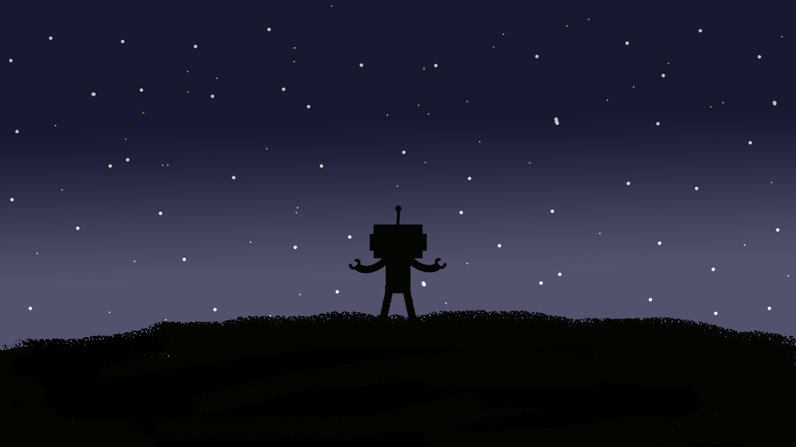
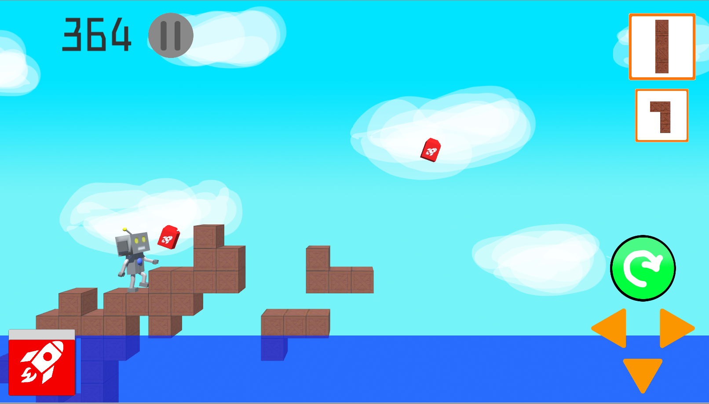

# roborisuran

## ファイル構成  
* [Unityデータ](./testgame/)  
* [ビルドデータ](./Executable/)  

## 概要  

## ジャンル  
横スクロールパズルアクション

## プラットフォーム  
* [Androidビルドデータ](./Executable/roborisuran_Android/)  
* [Windowsビルドデータ](/Executable/roborisuran_Windows/)  

## 担当ブログラムファイル  
* [画面外に出たオブジェクトの削除](./TetrisRunUp/Assets/c18018/Scripts/BlockExit.cs)  
* [ブロックのシステム](./TetrisRunUp/Assets/c18018/Scripts/Map.cs)  

## ゲームストーリー  
年々、争いや自然災害が多発し背面も上昇していく中、  
住む場所が少なくなった人間たちは、火星に移住してしまいました  
そんな中、地球取り残されたロボットが生きるため他の惑星に移ろうとする  

## ゲームルール  
木箱をうまく組み合わせて登っていく。  
ロボットは１段までなら自力で登るが、２段以上になると燃料を使って高く飛ぶ必要がある。  
燃料は使った分減るので、補給しながら進み、ハイスコアを目指す。  

## Unityバージョン  
Unity 2018.4.2f1  

## 製作期間  
１か月

## メンバー（役割）  
* 友寄隆也（デザイナー）  
* 又吉紗衣（プログラマ）  
* 宮城沙耶（プログラマ）  

## ゲームスクリーンショット  
  
  
  